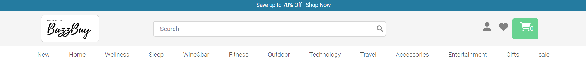
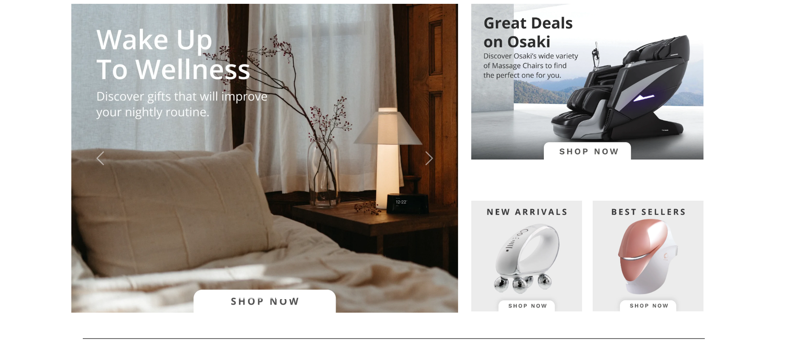
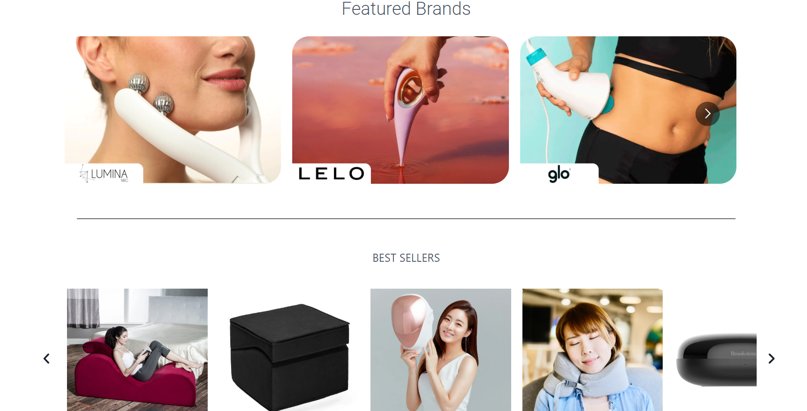
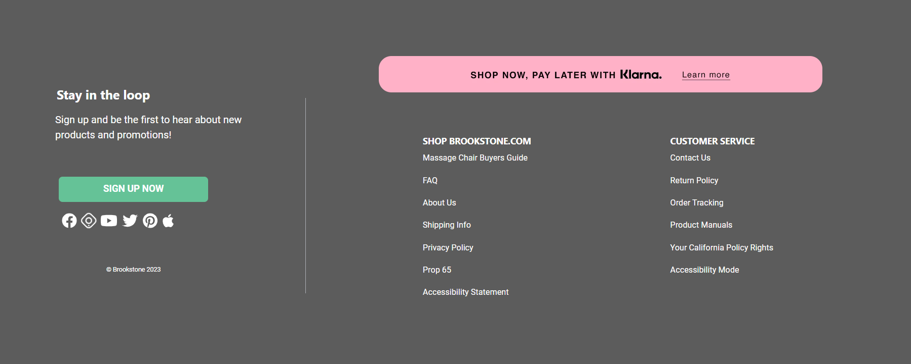
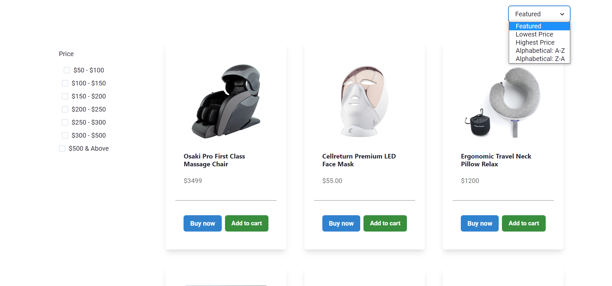
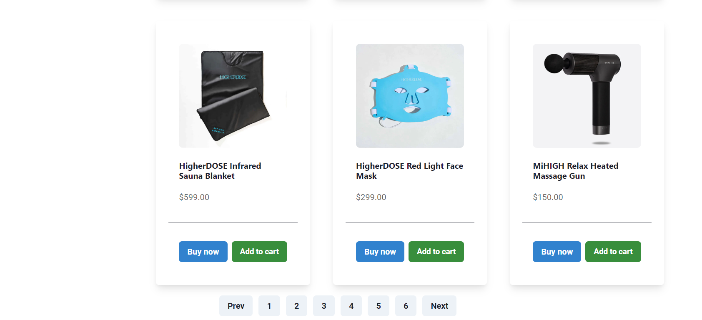
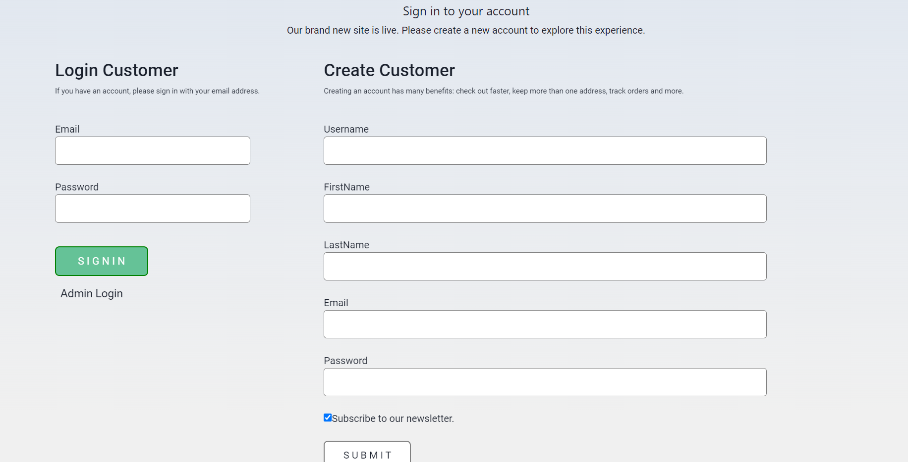

# ambiguous-class-8142
#BuzzBuy.com
This was an individual project made by me and executed in 5 days.
I did this project within 5 days in our unit-4 construct week. BuzzBuy is a ecommerce product based website  in USA that allows customers to purchase products in massage & personal care, home, travel, gifts, and more.
BuzzBuy is a chain of retail stores in the United States and China. It was founded as a mail-order business in 1965, when it started selling items, such as dental clamps and other specialty tools.
It has expanded to several product & offers for customers, as well as a few free offers provided by us if customers purchase mass product. 

<h1>Tech Stack</h1>
<ul>
<li>React js</li>
<li>Chakra UI</li>
</ul>

<h1>Features</h1>

<ul>
<li>Home Page</li>
<li>Login/Sign-up</li>
<li>Product Page</li>
<li>Cart Functionality</li>
<li>Admin Side</li>
</ul>

Following are the Screenshots for the reference
**Navbar page **

** Landing Page **

** Footer Page **

** Product Page **

** Login page **
